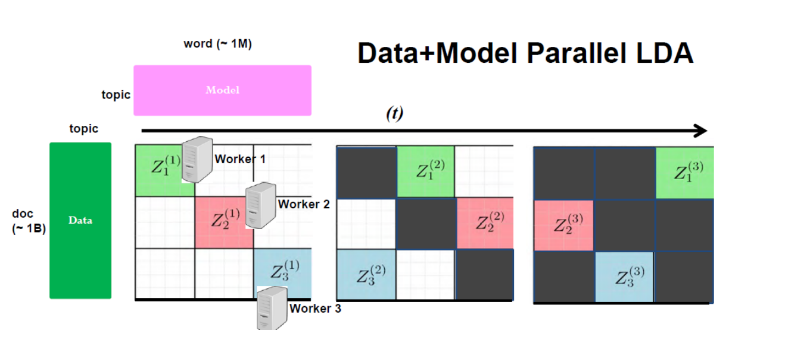

# Machine Learning layer for the Distributed Stream package
Under construction

This project contains the source code for a machine learning layer to work in conjunction with the Distributed Stream package. The intention of this package and the distributed stream package, is to harness computational power of volunteers by running Javascript code while they are visiting a website.


## Getting started

In order to get started, take a look at the example in the examples folder. This example uses the system in order to train a Matrix Factorization model. Matrix Factorization is often used for recommendation software, such as movie suggestions in Netflix. The basic idea of parallelizing Matrix Factorization is shown in the following image:
 (Image from _Strategies and principles of distributed machine learning on big data._ by Xing, Eric P and Ho, Qirong and Xie, Pengtao and Wei, Dai).

When the algorithm is started, it creates synthetic "Netflix" data. This data contains ratings which users have given movies. This data can be used to train a model in order to predict the "missing" data.

In order to run the Matrix Factorization example, run the following commands:
```
npm install
npm run build
```
OR
```
yarn install
yarn run build
```
These commands install all the required node_modules, and transpiles the example server and client code and stores it in the dist folder.

To run the example, run the following command:
```
node dist/server.js
```

This should start a web server at [http://localhost:3000/]
Visit the web server with a browser, and check the console logs. It might take a while before the computations start.

## Matrix Factorization example

There are two files in this folder, `MatrixFactorization.js` which contains all of the information specific to the Matrix Factorization algorithm, and `server.js` which connects the algorithm to the Distributed Stream.

The `MatrixFactorization.js` file defines a couple of variables, and some functions which are required by the `DistributedStreamML` class. The user needs to define `parameters`, `hyperparameters`, `initialData` and 3 functions: `partition`, `work` and a `guard`.

The `partition` function takes `parameters` as input, and should output partitions on how to divide the parameter space in order to parallelize the algorithm correctly. The `work` function is what is actually run on the volunteers' devices. The `guard` is used to determine whether the algorithm is done or not.

The example code contains some more explanation about what each function does.

## Matrix Factorization with WebAssembly (C++)

In addition to the Javascript implementation, it is also possible to run the system with the `work` function written in C++ (in this case, other languages are possible as well). This code can be found in the `webassembly` subdirectory in the example folder. In order to run the system using this example, install Emscripten in order to compile the code and run the following command while in the `webassembly` folder:
```
make compile
```
This compiles the C++ file, and stores the result in the dist folder.